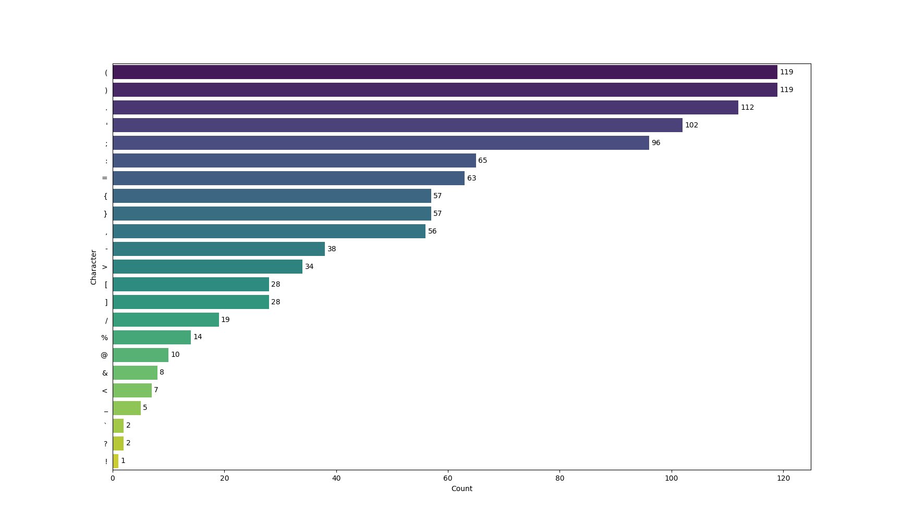

# Special Character Counter

This project contains a python script which counts the special characters inside any project. This can be helpful when creating a symbol layer on your programmable keyboard and deciding on where to place each symbol.



## How to run the script

1. Clone the project
2. Create a virtual environment
```bash
python3 -m venv char_env
```
3. Activate the virtual environment
```bash
source char_env/bin/activate
```
4. Install the required packages
```bash
pip install -r requirements.txt
```

5. **[Optional]** Add a `.exclude` file with the help of `.exclude.example` file to define regex rules for ignoring lines in files

6. Run the script
```bash
python main.py ./path/to/your/project
```

- The following parameters can be used to adjust the script's behaviour:


| Argument        | Type     | Choices                  | Default | Help                                                                                       |
|-----------------|----------|--------------------------|---------|--------------------------------------------------------------------------------------------|
| `--pattern`     | `str`    | `["single", "bigram"]`   | `single`| You can choose between counting single characters and bigrams. |
| `--ext`         | `str`    |                          | `ts`    | Choose your files the script should look at by file extension. |
| `--out`         | `str`    | `["visual", "cmd", "txt"]`| `visual`| Type of output for the results: Output in command line, saved in txt file or displayed in plot. |
| `--min_count`   | `int`    |                          |         | When specified, only ouput results which were counted at least `min_count` times. |
| `--max_entries` | `int`    |                          |         | When specified, only output the top `max_entries` results. |
| `--exclude_path`| `str`    |                          | `./.exclude`| You can define regex rules for ignoring lines in files in a file and provide the path to this file here. Each line in the regex file represents an ignore rule. |


